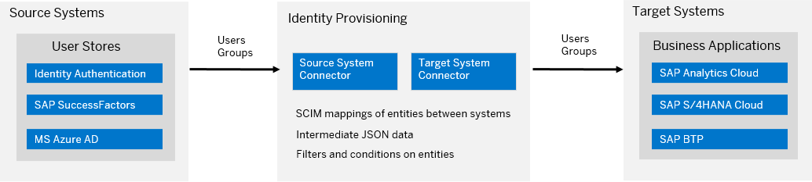

<!-- loio3f6182df7a4d4364aab00667be0d17b0 -->

# Provisioning Systems

Identity Provisioning provides connectors to various business applications for provisioning and deprovisioning of users and groups. These business applications are configured as provisioning systems in the SAP Cloud Identity Services administration console.

Similar to applications in Identity Authentication, provisioning systems can be seen as abstractions of business applications, where these abstractions are used for the purposes of Identity Provisioning.

A provisioning system used for reading users and groups is called source system. The source system is usually the user store of your organization. A provisioning system used for replicating users and groups is called target system. The target system is usually a cloud system with local user store, where entities are provisioned to from one or more source systems.

The main use case of Identity Provisioning is to read users and groups from a source system and provision them to a target system. This is the standard provisioning mode illustrated in the diagram above.

Identity Provisioning can also be used in proxy mode. In this mode, the service is used for synchronizing user data to and from a central identity management solution \(for example, the on-premise SAP Identity Management\) and a provisioning system - called proxy system \(for example, SAP Analytics Cloud, embedded edition\). Here, Identity Provisioning acts as a proxy between the identity management solution and the system with proxy configuration.

For more information, see [System Types](https://help.sap.com/docs/identity-provisioning/identity-provisioning/system-types?version=Cloud) and [Supported Systems](https://help.sap.com/docs/identity-provisioning/identity-provisioning/supported-systems?version=Cloud).

