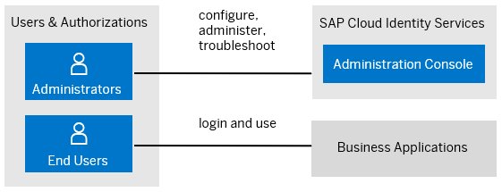

<!-- loio47bd58ef179e4be6baf869b8511bf99b -->

# Users

Users in SAP Cloud Identity Services fall into two categories: administrators and end users.

<a name="loio47bd58ef179e4be6baf869b8511bf99b__section_h44_jsf_2zb"/>

## Administrators

SAP Cloud Identity Services distinguish between two types of administrators: **user administrator** and **system administrator**.

-   User administrators are real persons. They manage tenant configurations, applications, corporate identity providers, identity provisioning, users and groups. The initial administrator of SAP Cloud Identity Services tenants is created as user administrator.

-   System administrators are technical users. They are used for establishing system-to-system communication in provisioning scenarios, accessing real-time provisioning and proxy system APIs, as well as accessing tenant API for running Identity Provisioning jobs. System administrators can also act as user administrators because they have the same authorizations.

<a name="loio47bd58ef179e4be6baf869b8511bf99b__section_npf_ksf_2zb"/>

## End Users

End users use business applications that consume Identity Authentication as identity provider. The service authenticates the users with credentials maintained in Identity Authentication or delegates the authentication request to a 3rd party identity provider. End users are initially created, imported or provisioned to the user store of SAP Cloud Identity Services.

There are six user types of end users:

<table>
<tr>
<th valign="top">

User Type

</th>
<th valign="top">

Description

</th>
</tr>
<tr>
<td valign="top">

*Customer* 

</td>
<td valign="top">

External users that are customers for the company. They may need access to some applications.

</td>
</tr>
<tr>
<td valign="top">

*Employee* 

</td>
<td valign="top">

Internal company users, mainly users with long-term contracts.

</td>
</tr>
<tr>
<td valign="top">

*Partner* 

</td>
<td valign="top">

External users from a partner company that will need some kind of access.

</td>
</tr>
<tr>
<td valign="top">

*Public* 

</td>
<td valign="top">

External users that are not controlled by the company. For example, self-registered.

</td>
</tr>
<tr>
<td valign="top">

*External* 

</td>
<td valign="top">

External users that can be a temporary hired employees that need access to some applications, or external users that need access to learning materials and training managed by the company.

</td>
</tr>
<tr>
<td valign="top">

*Onboardee* 

</td>
<td valign="top">

An employee user that needs a different authentication, because, for example the user may not exist in the corporate identity provider.

</td>
</tr>
</table>

